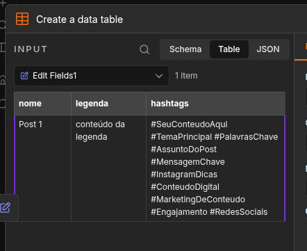
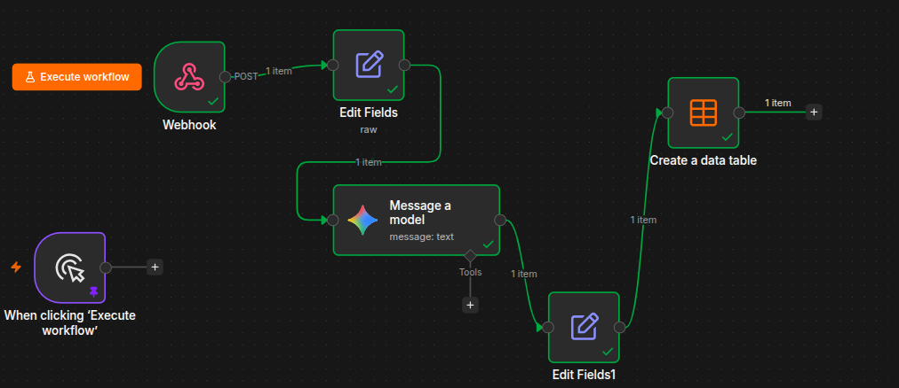
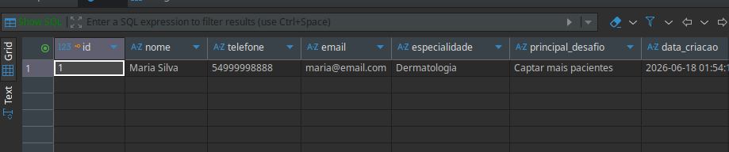

# Desafio 1 — Workflow de Automação no N8N

## Contexto

O objetivo foi construir um workflow no N8N que recebe dados de um post do Instagram via webhook, gera hashtags automaticamente com IA (Gemini) e persiste o resultado em uma tabela.

## Como rodar localmente

Suba o N8N via Docker:

```bash
docker volume create n8n_data
docker run -it --rm --name n8n -p 5678:5678 -v n8n_data:/home/node/.n8n docker.n8n.io/n8nio/n8n
```

Acesse `http://localhost:5678`, importe o arquivo `My workflow 2 (1).json` e configure a credencial do Google Gemini (PaLM API).

## Fluxo do Workflow

Para acionar o Webhook que fica no aguardo de uma solicitação post, rode o comando: ```curl -X POST http://localhost:5678/webhook-test/aprovado```

```
Webhook (POST /aprovado)
    → Edit Fields       # monta o payload do post (nome, descrição, legenda, status)
    → Message a model   # envia a legenda ao Gemini: "Gere hashtags para Instagram..."
    → Edit Fields1      # consolida: nome + legenda + hashtags retornadas
    → Create a data table  # persiste em posts_instagram
    → Get a label info  # notificação via Gmail
```

O dado entra pelo webhook com status `aprovado`, a legenda é enviada ao Gemini que devolve apenas as hashtags, e o resultado final é armazenado com nome e legenda originais.

## Evidências

| Resultado da execução | 
|---|
|  |



## Limitações e próximos passos

- O nó `Get a label info` (Gmail) está incompleto — seria substituído por um envio real de e-mail ou notificação no Slack com o resumo do post.
- Com mais tempo, adicionaria tratamento de erro entre os nós (ex: se o Gemini não retornar hashtags, o fluxo não deve persistir dados inválidos).
- O webhook não tem autenticação — em produção exigiria um token de validação.

---

# Desafio 2 — Integração de Leads (Python)

## Contexto

Simula o fluxo de captura, tratamento e armazenamento de leads de um formulário de diagnóstico, com geração do payload para criação de tarefa no ClickUp.

## Estrutura

```
Desafio-Orquestra-oN8N/
├── main.py           # Lógica principal
├── leads.db          # SQLite gerado automaticamente
└── README.md
```

## Como executar

```bash
cd Desafio-Orquestra-oN8N
python3 main.py
```

Requisitos: Python 3.10+ (apenas bibliotecas nativas: `sqlite3`, `json`, `re`)

## Fluxo dos dados

```
JSON de entrada
    → validar_e_tratar_dados()   # valida campos obrigatórios, limpa telefone e normaliza e-mail
    → salvar_no_banco()          # persiste no SQLite com timestamp
    → simular_clickup()          # exibe payload JSON da tarefa no ClickUp
```

Qualquer campo obrigatório ausente (`nome`, `telefone`, `email`, `especialidade`, `principal_desafio`) interrompe o fluxo e lista todos os erros antes de retornar.

| Dados persistidos |
|  |
## Tratamento de erros

- Campos vazios: coleta todos os erros e exibe antes de abortar (sem parar no primeiro).
- JSON inválido: capturado com `json.JSONDecodeError`.
- Falha no banco: capturado com `Exception` dentro de `salvar_no_banco`, sem propagar para quebrar o fluxo principal.

## Limitações e próximos passos

- A integração com o ClickUp é simulada (apenas gera o payload) — o próximo passo seria um `requests.post` autenticado para a API real.
- Não há verificação de duplicidade de e-mail no banco.
- Com mais tempo, extrairia a string de conexão do SQLite para uma variável de ambiente e adicionaria um campo `status` no lead para rastrear o ciclo de vida.
